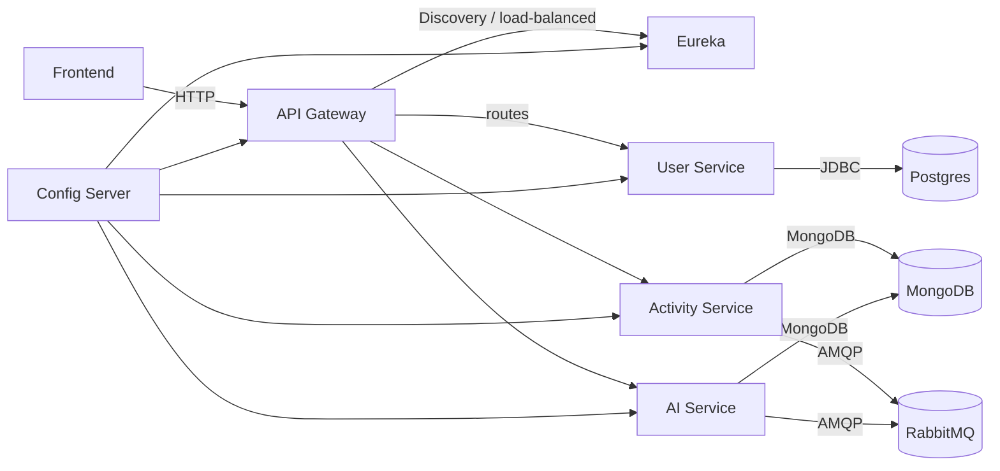

# Fitness App Microservices

## Overview
- This repository contains a Spring Cloud microservices example (Eureka, Config Server, API Gateway, and three services) plus a React frontend.
- Purpose: demo architecture using Spring Boot, Eureka service discovery, Spring Cloud Config, RabbitMQ events, MongoDB and PostgreSQL for persistence.

## Services & Ports
- **Config Server:** port 8888 (serves configs from classpath:/config)
- **Eureka (Discovery):** port 8761
- **API Gateway:** port 8080 (routes: /api/users/**, /api/activities/**, /api/recommendations/**)
- **User Service:** port 8081 (Postgres datasource)
- **Activity Service:** port 8082 (MongoDB + RabbitMQ)
- **AI Service:** port 8083 (MongoDB + RabbitMQ + external Gemini API)
- **Frontend (Vite):** dev server (see fitness-app-frontend package.json)

Key config files for service ports and settings are under the config server folder: [configserver/src/main/resources/config](configserver/src/main/resources/config)

## Prerequisites
- Java 23 (project property: `<java.version>23`)
- Maven (or use the bundled `mvnw` / `mvnw.cmd` wrappers)
- Node.js + npm (for frontend)
- PostgreSQL running on `localhost:5432` with DB `fitness_user_db` (or adjust `user-service` config)
- MongoDB running on `localhost:27017`
- RabbitMQ running on `localhost:5672`
- (Optional) OAuth / identity provider for gateway JWT validation (gateway expects a JWK URI)
- Environment variables for AI service: `GEMINI_API_URL` and `GEMINI_API_KEY`

## Run order (recommended)
1. Config Server
2. Eureka Server
3. API Gateway
4. User Service
5. Activity Service
6. AI Service
7. Frontend

## Run commands (Windows and Unix examples)

Start Config Server
```bash
cd configserver
./mvnw spring-boot:run    # Unix
mvnw.cmd spring-boot:run  # Windows
```

Start Eureka
```bash
cd eureka
./mvnw spring-boot:run
mvnw.cmd spring-boot:run
```

Start API Gateway
```bash
cd gateway
./mvnw spring-boot:run
mvnw.cmd spring-boot:run
```

Start services (example for user service)
```bash
cd userservice
./mvnw spring-boot:run
mvnw.cmd spring-boot:run
```

Start frontend
```bash
cd fitness-app-frontend
npm install
npm run dev
```

## Build
Package a service
```bash
cd activityservice
./mvnw -DskipTests package
```

## Notes & Configuration
- Service-specific configuration files are stored in `configserver/src/main/resources/config` (e.g., `user-service.yml`, `activity-service.yml`, `ai-service.yml`, `api-gateway.yml`). See those files for database URLs, RabbitMQ settings and example credentials.
- `activity-service` and `ai-service` expect MongoDB at `mongodb://localhost:27017` and RabbitMQ at `localhost:5672`.
- `user-service` default datasource points to a local PostgreSQL instance (`jdbc:postgresql://localhost:5432/fitness_user_db`) with credentials in the config file.
- The AI service references external Gemini API settings via `GEMINI_API_URL` and `GEMINI_API_KEY` environment variables.

## Architecture (mermaid)


## Where to look in the repo
- Frontend: fitness-app-frontend (Vite + React)
- Gateway: gateway
- Services: userservice, activityservice, aiservice
- Discovery: eureka
- Config server: configserver (configuration files in `src/main/resources/config`)

## Next steps / Tips
- Ensure required infrastructure (Postgres, MongoDB, RabbitMQ) is running before starting the services.
- If you use Docker, consider adding a `docker-compose.yml` to orchestrate the Datastores and RabbitMQ.
- To change ports or credentials, edit the corresponding YAML in `configserver/src/main/resources/config`.

---
Generated README for this workspace.
